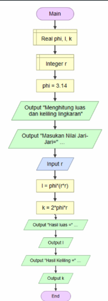
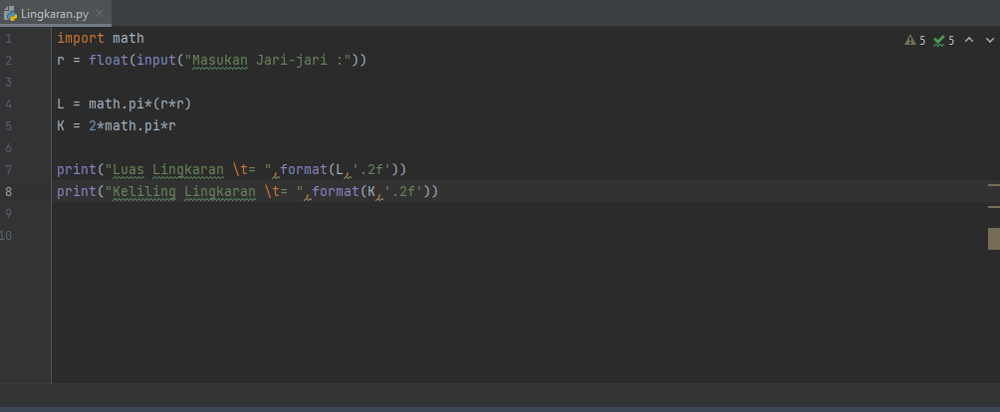
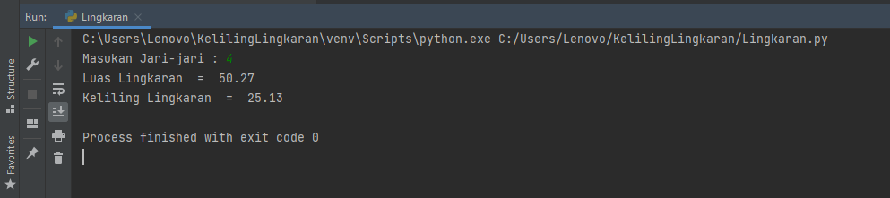

# Labs2-MenghitungLingkaran
## Cara Membuat Progam Menghitung Luas dan Keliling Lingkaran

### Pertama, membuat flowchart 
flowchart berfungsi untuk menggambarkan secara jelas suatu alur pekerjaan dan kerangka acuan dalam pengambilan keputusan. Berikut adalah gambar flowchart dari menghitung luas dan keliling lingkaran.                                  

### Kedua, menggunakan import math
Untuk kode math.pi menggunakan 3.14, seperti gambar dibawah ini. 
 
Untuk kode \t merupakan karakter espace yang berfungsi untuk membuat tab.
### Berikut adalah contoh hasil output progam menghitung luas dan keliling lingkaran
